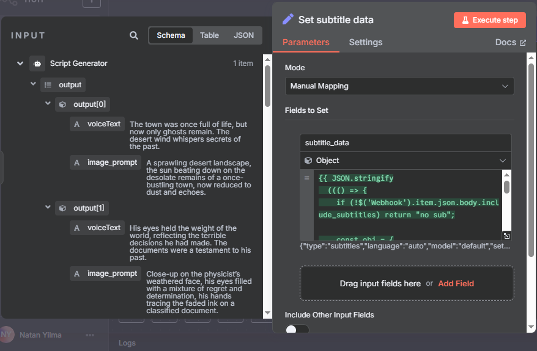

# N8N Long Form Video Generator
- User fills a form to generate a long form video based on topic and tags (single word descriptions), optionally including Intro video and background music.
- You can check it out by importing `Viral_Video_Generator.json` into n8n.

## Nodes 

- Trigger
    - Webhook
- LLM chain, AI agent
- Http Request
    - Create video
    - Check video status
    - Download video
- Telegram
    - Send video
- Wait, Switch, Set nodes

## Input

## Output

- It has successfully generated a video based on the form details and sent it to my Telegram through a Telegram Bot.

## Steps

- To create an intro video and background music.
    
    - Get your free api key from `json2video` and create a new video template and click on edit. Add a video in your template and select the video to add source from pexels or local.

        

    - Use chatgpt to generate a prompt for `Suno AI` to generate music based on the video niche. Download the music and upload it to `json2video` template as an audio element's source.

        

    - Select the video and it's source to copy the video url. Do the same for the audio, and use the links in the form below.

        

- Open `index.html` in a browser and fill the form. You will use the webhook url from the next step.

- Setup a webhook to receive form details from the form created in the previous step. Copy the webhook url to the form.

    

    

    

- Attach an `LLM chain` node to create caption and video ideas. It should output `idea`, `caption`, `character_style_prompt`, `channel_style_prompt`.

    

    

- Attach another `LLM chain` or `AI Agent` to create the script in small bits each about a sentence long. It should output an array of objects each containing `voiceText` and `image_prompt`.

    

    

- Check the documentation of `json2video` to understand the json syntax and what to expect by visiting both the archived documentation and json syntax section.

    

    

- Add a `Set` node to format the `subtitle` setting object if any is requested by the user.

    

    

- Add another `Set` node to format the `body` for the post request.

    

    

    

- Attach an `Http Request` node to send the post request to `json2video`. Add `Authentication` with `Header Auth` and use your `json2video` api key in `x-api-key` header.

    

- Attach another `Http Request` node to check the status of the video.

    

- Attach a `Switch` node to switch between `Wait` and `Check Video Status` nodes.

    

    

- Attach a `Wait` node to wait for 20 seconds.

- Attach an `Http Request` node to download the video when it is done.

    

- And finally send the video on Telegram using `Send video` operation. Don't forget to create a bot and get your chat id using `@get_id_bot` in the bot chat.

    

## Contact
 - LinkedIn: [Natan Asrat](https://linkedin.com/in/natan-asrat)
 - Gmail: nathanyilmaasrat@gmail.com
 - Telegram: [Natan Asrat](https://t.me/fail_your_way_to_success)
 - Youtube: [Natville](https://www.youtube.com/@natvilletutor)